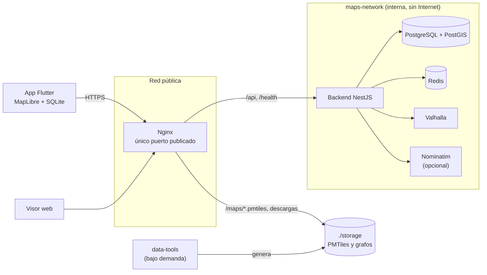

# Maps Platform

Plataforma propia de mapas y navegación construida sobre datos de
OpenStreetMap: mapas vectoriales generados por nosotros, cálculo de rutas
autohospedado, mapas descargables por región para usar sin conexión, rutas
guardadas, recorridos con GPS y sincronización offline-first entre la app
móvil y el servidor.

- **Backend**: monolito modular NestJS + PostgreSQL/PostGIS + Redis.
- **Routing**: Valhalla autohospedado (OSRM como alternativa), nunca expuesto a Internet.
- **Mapas**: teselas vectoriales propias (Planetiler) en archivos PMTiles por región.
- **App**: Flutter (Android e iOS) con MapLibre, Riverpod, Drift y Dio.
- **Entrada única**: Nginx es el único servicio publicado.

No se usan teselas ni datos de Google Maps y no se descargan teselas de
`tile.openstreetmap.org`: todos los mapas se generan a partir de extractos
`.osm.pbf` de proveedores legítimos (Geofabrik).

## Contenido

1. [Arquitectura](#arquitectura)
2. [Tecnologías](#tecnologías)
3. [Requisitos](#requisitos)
4. [Instalación](#instalación)
5. [Variables de entorno](#variables-de-entorno)
6. [Docker](#docker)
7. [Migraciones](#migraciones)
8. [Carga de datos OSM](#carga-de-datos-osm)
9. [Preparación del routing](#preparación-del-routing)
10. [Mapas offline](#mapas-offline)
11. [App Flutter](#app-flutter)
12. [Endpoints](#endpoints)
13. [Swagger](#swagger)
14. [Pruebas](#pruebas)
15. [Troubleshooting](#troubleshooting)
16. [Producción](#producción)
17. [Licencias y atribución](#licencias-y-atribución)

## Arquitectura



- El backend es un monolito modular (auth, users, regions, maps, routing,
  trips, tracking, places, geofences, geocoding, synchronization, health),
  separado en capas de dominio, aplicación, infraestructura y presentación.
- Los mapas y grafos de cada región se generan con la imagen `data-tools` en
  `./storage`, fuera del arranque de los servicios.
- La app funciona sin conexión con los mapas descargados y sus rutas guardadas,
  y sincroniza cuando vuelve la conexión.

Detalle y diagramas: [docs/architecture.md](docs/architecture.md),
[docs/offline-architecture.md](docs/offline-architecture.md),
[docs/routing.md](docs/routing.md) y [docs/maps.md](docs/maps.md).

## Tecnologías

| Área | Tecnología |
| --- | --- |
| API | Node.js 24, NestJS 11, TypeScript, Prisma 7, class-validator, Swagger, Pino |
| Base de datos | PostgreSQL 17 + PostGIS 3.5 (`postgis/postgis:17-3.5`) |
| Caché | Redis 8 |
| Routing | Valhalla 3.9 (`ghcr.io/valhalla/valhalla:3.9.0`); adaptador OSRM disponible |
| Geocoding | Nominatim 5.1 (perfil opcional `geocoding`) |
| Mapas | Planetiler 0.10 (Java 21) → PMTiles v3, estilo MapLibre propio, glifos Noto Sans |
| Proxy | Nginx 1.28 |
| App | Flutter 3.47, maplibre_gl, flutter_riverpod 3, drift, dio, geolocator |
| Contenedores | Docker, Docker Compose |

## Requisitos

- Docker 24 o superior con Docker Compose 2.24.4 o superior.
- `make` y `bash` (Linux/macOS/WSL). En Windows sin WSL: `.\make.ps1 <comando>`.
- Memoria asignada a Docker: 4 GB para una ciudad; para preparar Ecuador completo
  se recomiendan 8 GB y `TILEGEN_MEMORY=4g` (generación de teselas y grafo).
- Disco: espacio para el extracto, el mapa y el grafo de cada región, en
  `./storage` (`du -sh storage/*` muestra lo ocupado).
- Para la app: Flutter 3.47.5 y JDK 21 (ver [mobile/README.md](mobile/README.md)).
- Para desarrollar el backend fuera de Docker: Node.js 22.12 o superior.

## Instalación

```bash
git clone https://github.com/DrubberSan16/route-maps.git
cd route-maps
make init                             # crea .env con secretos aleatorios
make up                               # construye y levanta el stack
make prepare-region REGION=guayaquil  # descarga, mapa, routing y registro
```

Guayaquil se recorta del extracto de Ecuador, así que la primera vez se descarga
Ecuador completo desde Geofabrik; las regiones siguientes reutilizan ese
extracto.

- Visor web de desarrollo: <http://localhost:8080>
- API: <http://localhost:8080/api/v1>
- Swagger: <http://localhost:8080/api/docs>
- Salud: <http://localhost:8080/health>

`make up` no descarga ni procesa datos geográficos: el stack arranca vacío y
cada región se prepara con `make prepare-region`. Mientras no haya un grafo
para `ROUTING_REGION`, el servicio `routing` espera (lo revisa cada 30 s y
arranca solo cuando aparece) y el cálculo de rutas responde
`ROUTING_PROVIDER_UNAVAILABLE`.

Comprobación completa del stack (salud, auth, regiones, descargas con Range,
rutas en todos los perfiles, recorridos, sincronización, visor):

```bash
./infrastructure/scripts/smoke-test.sh http://localhost:8080
```

## Variables de entorno

Todas salen de `.env` (plantilla comentada: [.env.example](.env.example));
`docker-compose.yml` no contiene contraseñas, tokens ni secretos y se niega a
arrancar si faltan (`DATABASE_PASSWORD`, `REDIS_PASSWORD`, `JWT_SECRET`,
`JWT_REFRESH_SECRET`). `.env` nunca se sube a Git.

| Variable | Uso |
| --- | --- |
| `NGINX_HTTP_PORT` | Puerto del host publicado por Nginx (8080 en desarrollo) |
| `DATABASE_NAME`, `DATABASE_USER`, `DATABASE_PASSWORD` | PostgreSQL |
| `REDIS_PASSWORD`, `REDIS_MAXMEMORY` | Redis |
| `JWT_SECRET`, `JWT_REFRESH_SECRET` | Firma de tokens (distintos, 32+ caracteres en producción) |
| `JWT_ACCESS_TTL_SECONDS`, `JWT_REFRESH_TTL_SECONDS` | Vigencia de los tokens (15 min y 30 días) |
| `CORS_ORIGINS` | Orígenes permitidos (obligatorio en producción) |
| `SWAGGER_ENABLED` | Publica `/api/docs` |
| `RATE_LIMIT_TTL_MS`, `RATE_LIMIT_MAX` | Límite de peticiones por IP en la API |
| `ROUTING_PROVIDER` | `valhalla` (por defecto) u `osrm` |
| `ROUTING_REGION` | Región cuyo grafo sirve el contenedor `routing` |
| `ROUTING_LANGUAGE` | Idioma de las indicaciones (`es-ES`) |
| `ROUTING_MAX_ALTERNATIVES` | Rutas alternativas como máximo (2 por defecto, hasta 3) |
| `GEOCODING_PROVIDER` | `none` o `nominatim` |
| `NOMINATIM_REGION`, `NOMINATIM_PASSWORD` | Extracto importado por Nominatim |
| `STORAGE_PATH` | Carpeta con `imports/`, `maps/` y `routing/` |
| `TILEGEN_MEMORY`, `VALHALLA_BUILD_THREADS` | Recursos para preparar regiones |
| `SEED_DEMO_DATA`, `SEED_ADMIN_PASSWORD`, `SEED_DEMO_PASSWORD` | Datos de demostración (solo desarrollo) |

## Docker

| Servicio | Imagen | Publicado | Función |
| --- | --- | --- | --- |
| `nginx` | propia (nginx 1.28) | `NGINX_HTTP_PORT` | Proxy de la API, PMTiles con Range, descargas autorizadas, visor web |
| `backend` | propia (Node 24) | no | API REST `/api/v1`, migraciones al arrancar |
| `postgres` | `postgis/postgis:17-3.5` | no | Datos y consultas geoespaciales |
| `redis` | `redis:8-alpine` | no | Caché de rutas, regiones y geocoding |
| `routing` | propia (Valhalla 3.9) | no | Motor de rutas de `ROUTING_REGION` |
| `data-tools` | propia (perfil `tools`) | no | Descarga extractos, genera PMTiles, grafos y manifiestos |
| `nominatim` | `mediagis/nominatim:5.1` (perfil `geocoding`) | no | Búsqueda de direcciones |

- Redes: `edge` (Nginx y la descarga de extractos) y `maps-network`
  (`internal: true`, sin salida a Internet). PostgreSQL, Redis, el backend y
  Valhalla no publican puertos.
- Volúmenes: `postgres_data`, `redis_data`, `nominatim_data` y la carpeta
  `./storage` montada en solo lectura en Nginx, el backend y `routing`.
- Para acceder a PostgreSQL desde el host en desarrollo, copia
  `docker-compose.override.example.yml` a `docker-compose.override.yml`
  (publica el puerto solo en `127.0.0.1`).

Comandos habituales: `make ps`, `make logs SERVICE=backend`, `make restart
SERVICE=routing`, `make down`, `make config`. `make help` lista todos.

## Migraciones

El esquema está en [backend/prisma/schema.prisma](backend/prisma/schema.prisma)
y las migraciones en `backend/prisma/migrations/`. Tablas: `users`,
`refresh_tokens`, `devices`, `map_regions`, `downloaded_regions`, `places`,
`favorite_places`, `routes`, `route_points`, `route_tombstones`, `trips`,
`trip_points`, `geofences` y `synchronization_events`; las geometrías usan
tipos PostGIS con índices GiST.

- El backend aplica las migraciones pendientes al arrancar (`RUN_MIGRATIONS=true`).
- A mano: `make migrate`.
- Datos de demostración: `make seed` (usuarios `admin@maps.local` y
  `demo@maps.local`; en desarrollo sus contraseñas por defecto están en
  `.env.example`).
- Nueva migración durante el desarrollo: modifica el esquema y ejecuta
  `cd backend && npm run prisma:migrate:dev -- --name <cambio>` con
  `DATABASE_URL` apuntando a una base de desarrollo.

## Carga de datos OSM

Las regiones se definen en
[infrastructure/regions/regions.json](infrastructure/regions/regions.json):
cada una se descarga de Geofabrik (`source.url`) o se recorta de su región
padre con un `bbox` (`source.parent`). El catálogo incluye Ecuador, Guayas,
Guayaquil, Pichincha, Quito y Mónaco (región pequeña para pruebas).

```bash
make regions                           # catálogo y lo ya generado
make download-region REGION=guayaquil  # solo el extracto .osm.pbf
make build-map REGION=guayaquil        # solo el mapa PMTiles
make prepare-region REGION=guayaquil   # todo: extracto, mapa, routing, manifiesto, registro
```

- Los extractos se guardan en `storage/imports/`, se verifican con el MD5
  publicado por Geofabrik y con `osmium`, y se reanudan si la descarga se corta.
- Para agregar una región, añade una entrada al catálogo (código en minúsculas,
  `bbox` como `[oeste, sur, este, norte]`) y ejecuta `make prepare-region`.
- Los archivos GIS (`.osm.pbf`, `.pmtiles`, grafos) nunca se versionan en Git.
- `WATER=1` dibuja los océanos con los polígonos de OSMCoastline (descarga
  única de ~1 GB); sin ellos, las zonas de mar se ven con el color de fondo.

## Preparación del routing

```bash
make build-routing REGION=guayaquil
```

Genera el grafo de Valhalla en `storage/routing/guayaquil/` (con el paquete
`guayaquil.valhalla.tar`) y reemplaza el anterior de forma atómica. El
contenedor `routing` sirve la región de `ROUTING_REGION`; después de cambiarla:
`docker compose up -d routing` (`make prepare-region` lo reinicia solo cuando
reconstruye esa región). Perfiles: auto, camión, moto, bicicleta y a pie; la
ruta principal y hasta 2 alternativas (`ROUTING_MAX_ALTERNATIVES`); indicaciones
en español. Detalles, límites y la alternativa OSRM en
[docs/routing.md](docs/routing.md).

## Mapas offline

1. `make prepare-region` genera `storage/maps/<carpeta>/<región>.pmtiles` y su
   manifiesto `<región>.region.json` (versión `AAAA.MM.DD.HHMM`, SHA-256, bbox,
   zooms).
2. El backend registra los manifiestos al arrancar o con `make regions-sync` y
   los publica en `GET /api/v1/maps/regions`.
3. La app descarga el archivo con `GET /api/v1/maps/regions/{id}/download`:
   el backend autoriza y Nginx lo entrega (`X-Accel-Redirect`) con soporte de
   `Range`/`If-Range` y la cabecera `X-Checksum-Sha256`.
4. La app escribe en un `.part`, reanuda si se corta, comprueba el espacio
   libre y el SHA-256, y solo entonces reemplaza la versión anterior.
5. Con `POST /api/v1/maps/regions/updates` la app sabe qué regiones tienen
   versión nueva.

Los mismos PMTiles se sirven en línea en `/maps/<carpeta>/<región>.pmtiles`
(lecturas por rango, sin generar teselas en el servidor). Esquema de capas,
estilo y glifos en [docs/maps.md](docs/maps.md); comportamiento sin conexión
en [docs/offline-architecture.md](docs/offline-architecture.md).

## App Flutter

```bash
cd mobile
flutter pub get
flutter run --dart-define=API_BASE_URL=http://10.0.2.2:8080   # emulador Android
```

Pantallas: mapa principal (búsqueda, Mi ubicación, Trazar ruta, Mapas
offline), búsqueda, mapas offline, rutas guardadas, recorridos y cuenta con el
estado de la sincronización. Configuración, permisos y compilación de release
en [mobile/README.md](mobile/README.md).

## Endpoints

Prefijo `/api/v1` salvo `/health`. Respuestas `{ "success": true, "data": … }`
o `{ "success": false, "error": { "code", "message", "details", "requestId" } }`.
🔓 público, 🔑 requiere `Authorization: Bearer`, 🛡️ administrador.

| Módulo | Endpoints |
| --- | --- |
| Salud | 🔓 `GET /health` (base de datos, Redis, routing, geocoding) · 🔓 `GET /health/live` |
| Auth | 🔓 `POST /auth/register` · 🔓 `POST /auth/login` · 🔓 `POST /auth/refresh` (rotación) · 🔓 `POST /auth/logout` · 🔑 `GET /auth/me` |
| Usuarios | 🔑 `PATCH /users/me` · 🔑 `POST /users/me/devices` · 🔑 `GET /users/me/devices` |
| Regiones | 🔓 `GET /maps/regions` · 🔓 `GET /maps/regions/locate?lat=&lng=` · 🔓 `GET /maps/regions/{id}` · 🔓 `GET /maps/regions/{id}/version` · 🔓 `POST /maps/regions/updates` · 🔓 `GET /maps/regions/{id}/download` · 🔓 `GET /maps/regions/{id}/routing/download` · 🔑 `GET /maps/regions/downloaded` · 🛡️ `POST /maps/regions/sync` · 🛡️ `PATCH /maps/regions/{id}` |
| Rutas | 🔓 `POST /routes/calculate` · 🔑 `POST /routes` · 🔑 `GET /routes` · 🔑 `GET /routes/{id}` · 🔑 `DELETE /routes/{id}` |
| Recorridos | 🔑 `POST /trips` · 🔑 `GET /trips` · 🔑 `GET /trips/{id}` · 🔑 `GET /trips/{id}/path?maxPoints=` · 🔑 `POST /trips/{id}/finish` · 🔑 `POST /trips/{id}/cancel` |
| Tracking | 🔑 `POST /tracking/location` · 🔑 `POST /tracking/locations/batch` · 🔑 `GET /tracking/trips/{tripId}/last` |
| Lugares | 🔑 `POST /places` · 🔑 `GET /places` · 🔑 `GET /places/{id}` · 🔑 `PATCH /places/{id}` · 🔑 `DELETE /places/{id}` · 🔑 `PUT /places/{id}/favorite` · 🔑 `DELETE /places/{id}/favorite` |
| Geocercas | 🔑 `POST /geofences` · 🔑 `GET /geofences` · 🔑 `GET /geofences/check?lat=&lng=` · 🔑 `GET /geofences/{id}` · 🔑 `PATCH /geofences/{id}` · 🔑 `DELETE /geofences/{id}` |
| Geocoding | 🔓 `GET /geocoding/search?q=` · 🔓 `GET /geocoding/reverse?lat=&lng=` |
| Sincronización | 🔑 `POST /sync/push` · 🔑 `GET /sync/pull?since=&afterId=` |

Nginx además sirve `/maps/<carpeta>/<región>.pmtiles`, `/maps/style/style.json`
y `/maps/fonts/{fontstack}/{range}.pbf`.

## Swagger

Documentación interactiva en `/api/docs` y el esquema OpenAPI en
`/api/docs-json`. Activo por defecto en desarrollo (`SWAGGER_ENABLED=true`) y
desactivado en producción salvo que se habilite explícitamente.

## Pruebas

```bash
make test-backend   # Jest: pruebas unitarias del backend
make test-e2e       # e2e contra PostGIS real (E2E_DATABASE_URL a una base *_e2e)
make test-tilegen   # generador de mapas (Maven, Java 21)
make test-mobile    # Flutter: unitarias y de widgets
make lint           # ESLint, Prettier, dart format y flutter analyze
./infrastructure/scripts/smoke-test.sh   # stack completo levantado, a través de Nginx
```

Las pruebas e2e crean y vacían sus propias tablas: `E2E_DATABASE_URL` debe
apuntar a una base cuyo nombre termine en `_e2e`, por ejemplo
`postgresql://maps:<contraseña>@localhost:5432/maps_e2e`. El workflow de CI
([.github/workflows/ci.yml](.github/workflows/ci.yml)) ejecuta todas estas
comprobaciones y prepara la región de Mónaco para la prueba de humo.

## Troubleshooting

| Síntoma | Causa y solución |
| --- | --- |
| `docker compose up` falla con `Set DATABASE_PASSWORD in .env` | Falta `.env`: `make init` |
| `routing` en *starting* o *unhealthy* y rutas con `ROUTING_PROVIDER_UNAVAILABLE` | No hay grafo para `ROUTING_REGION` (`make logs SERVICE=routing` lo dice): `make prepare-region REGION=<región>` o cambia `ROUTING_REGION` |
| La ruta falla con `ROUTE_NOT_FOUND` | Los puntos están fuera de la región que sirve `routing` o lejos de cualquier calle |
| La ruta falla con `INVALID_COORDINATES` | Coordenadas fuera de rango, origen igual al destino o puntos a más de 2.000 km |
| El catálogo de regiones está vacío | La región no se registró: `make regions-sync` (o reinicia el backend) |
| La descarga de un extracto se corta | Vuelve a ejecutar el comando: continúa desde el `.part` |
| El mar se ve del color del fondo | Genera el mapa con `WATER=1` para dibujar los océanos |
| La app no llega al servidor desde un teléfono | Usa la IP del equipo en `API_BASE_URL` y abre el puerto 8080 en el firewall |
| La app dice "Sin conexión" con Wi-Fi | La app comprueba `/health/live`: revisa que Nginx y el backend estén sanos (`make ps`) |
| La preparación de una región termina con `Killed` o código 137 | Falta memoria: sube la memoria de Docker, ajusta `TILEGEN_MEMORY` o prepara una región más pequeña |
| Respuestas `429` | Límite de Nginx (30 peticiones/s por IP, ráfagas de 60) o del backend (`RATE_LIMIT_MAX` por ventana de `RATE_LIMIT_TTL_MS`, código `RATE_LIMIT_EXCEEDED`) |

## Producción

```bash
make prod-up    # docker compose -f docker-compose.yml -f docker-compose.prod.yml up -d --build
```

- `docker-compose.prod.yml` fija `NODE_ENV=production`: el backend no arranca
  con secretos JWT débiles (menos de 32 caracteres, iguales entre sí o con
  `CHANGE_ME`), y Swagger y los datos de demostración quedan desactivados salvo
  que se activen en `.env`.
- TLS en Nginx: `NGINX_SERVER_CONF=./infrastructure/nginx/tls/https.conf` y
  certificados `fullchain.pem`/`privkey.pem` en `TLS_CERTS_PATH` (nunca en Git).
  Detrás de un balanceador que termina TLS, basta el puerto HTTP.
- `CORS_ORIGINS` es obligatorio; todos los servicios tienen reinicio automático
  y límites de memoria ajustables (`BACKEND_MEMORY_LIMIT`, `ROUTING_MEMORY_LIMIT`, …).
- Respaldos: `docker compose exec -T postgres pg_dump -U maps maps > respaldo.sql`
  (usuario y base según `DATABASE_USER` y `DATABASE_NAME`).
  `./storage` se puede regenerar a partir de los extractos.
- Actualizar mapas: vuelve a ejecutar `make prepare-region` (nueva versión) y
  las apps ofrecen la actualización; los usuarios conservan la versión anterior
  hasta que la nueva esté completa y verificada.
- El servicio `routing` sirve una región: para varios países, un contenedor por
  región detrás del backend o un grafo que las incluya (ver
  [docs/routing.md](docs/routing.md)).

## Licencias y atribución

- **Datos del mapa**: © OpenStreetMap contributors, disponibles bajo la
  [Open Database License (ODbL) 1.0](https://opendatacommons.org/licenses/odbl/).
  La atribución se muestra siempre sobre el mapa en la app y en el visor, y va
  en la metadata de los PMTiles y del estilo. Los PMTiles y los grafos de
  routing contienen datos de OpenStreetMap: al distribuirlos (por ejemplo, en
  las descargas de la app) se aplican las condiciones de la ODbL, atribución y
  compartir bajo la misma licencia las bases de datos derivadas
  (<https://www.openstreetmap.org/copyright>).
- **Tipografías**: Noto Sans (SIL Open Font License 1.1,
  [infrastructure/maps/fonts/OFL.txt](infrastructure/maps/fonts/OFL.txt)).
- **Software de terceros**: Valhalla, OSRM, Planetiler, MapLibre, Nominatim,
  PostgreSQL/PostGIS, Redis, Nginx y los paquetes de npm, Maven y pub
  mantienen sus propias licencias.
