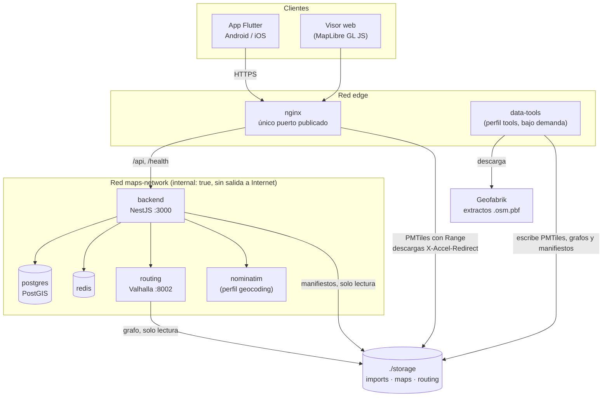
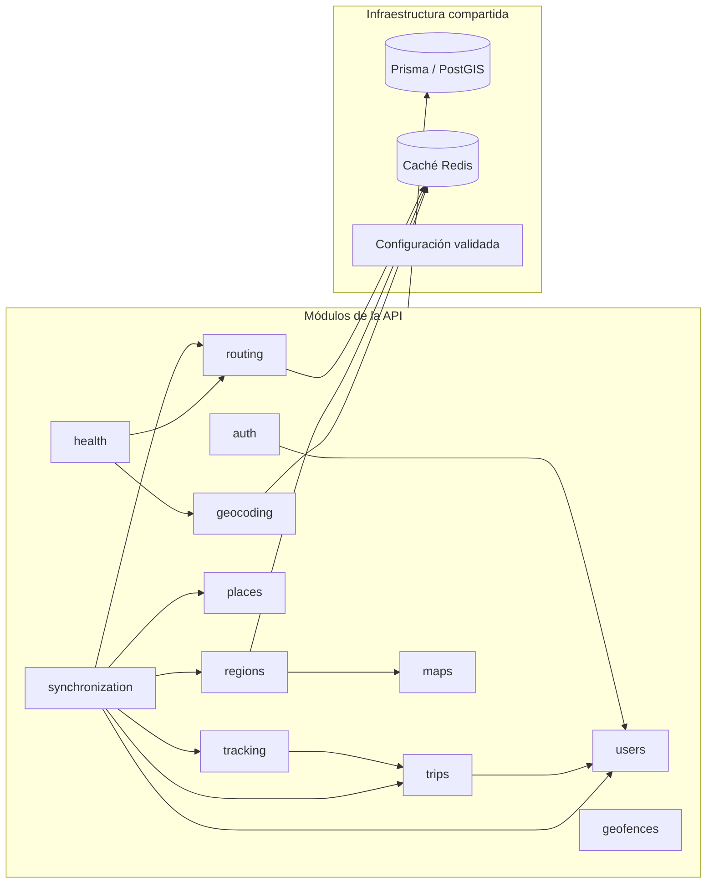
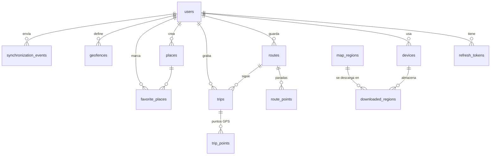
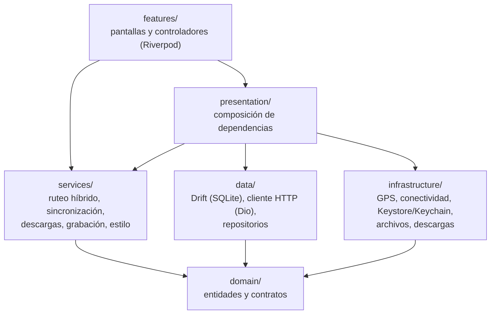
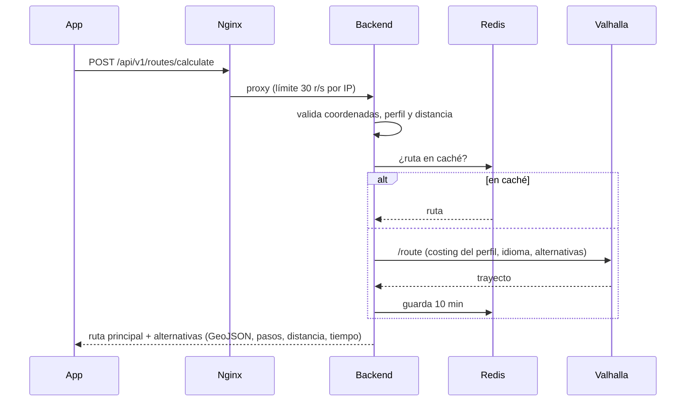
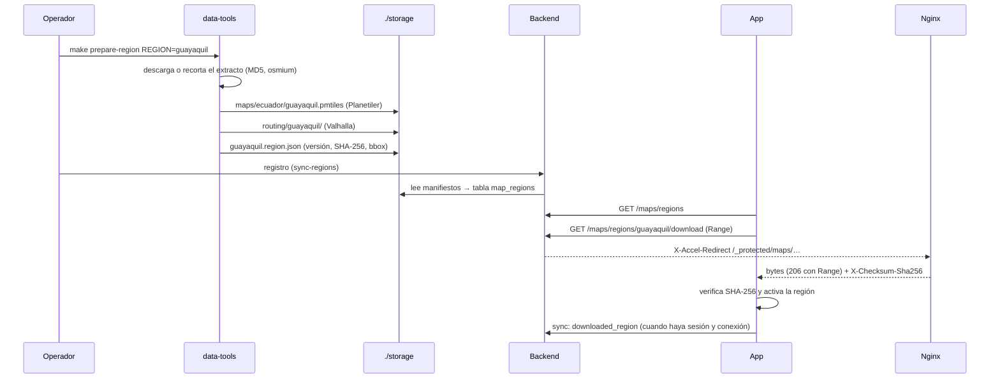
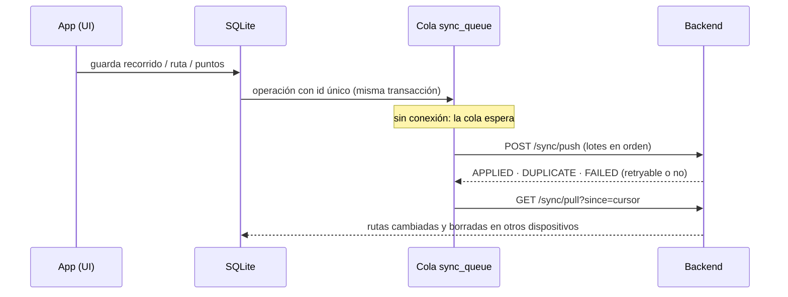

# Arquitectura

Visión general de los componentes de la plataforma, cómo se despliegan y cómo
fluyen los datos entre ellos. El comportamiento sin conexión está en
[offline-architecture.md](offline-architecture.md), el cálculo de rutas en
[routing.md](routing.md) y la generación de mapas en [maps.md](maps.md).

## Despliegue

- **Nginx** es el único servicio con puertos publicados. Hace de proxy de la
  API, sirve los PMTiles por rangos de bytes, entrega las descargas de regiones
  que autoriza el backend (`X-Accel-Redirect`) y publica el visor web.
- **maps-network** es una red interna de Docker: PostgreSQL, Redis, Valhalla,
  Nominatim y el backend no son accesibles desde fuera ni tienen salida a
  Internet.
- **data-tools** solo existe mientras se prepara una región
  (`make prepare-region`); es el único contenedor que descarga datos.
- **./storage** separa los datos geográficos (regenerables) de la base de datos:
  `imports/` (extractos), `maps/<carpeta>/` (PMTiles y manifiestos) y
  `routing/<región>/` (grafos de Valhalla).

## Backend

Monolito modular en NestJS. Cada módulo agrupa su dominio y separa en capas lo
que necesita: `domain` (entidades, contratos), `application` (casos de uso,
DTO), `infrastructure` (Prisma, HTTP a motores externos) y `presentation`
(controladores).

| Módulo | Responsabilidad |
| --- | --- |
| `auth` | Registro, login, JWT de acceso y refresh con rotación (refresh guardado como hash) |
| `users` | Perfil y dispositivos (`installationId` estable por instalación) |
| `maps` | Almacenamiento de mapas: lectura de manifiestos y rutas de archivos en `MAP_STORAGE_PATH` |
| `regions` | Catálogo de regiones, versiones, actualizaciones, localización por coordenada y descargas con `Range` |
| `routing` | Cálculo de rutas con Valhalla u OSRM (adaptadores intercambiables) y rutas guardadas |
| `trips` / `tracking` | Recorridos y puntos GPS (lotes idempotentes por `trip_id` + `recorded_at`) |
| `places` / `geofences` | Lugares, favoritos y geocercas (círculo o polígono, consultas PostGIS) |
| `geocoding` | Búsqueda y geocodificación inversa con Nominatim (o desactivado) |
| `synchronization` | `push` de operaciones offline y `pull` de cambios de otros dispositivos |
| `health` | Estado de base de datos, Redis, routing y geocoding |

Transversal: validación global (`class-validator`, `whitelist`), filtro de
errores con respuesta uniforme y `requestId`, logs JSON con Pino (sin
contraseñas ni tokens), límite de peticiones (`@nestjs/throttler`), guardas JWT
y de rol (`@Public`, `@Roles(ADMIN)`), Swagger generado desde los DTO.

### Modelo de datos

Las geometrías son columnas PostGIS en SRID 4326 (`geometry(Point|LineString|Polygon, 4326)`)
con índices GiST; Prisma las declara como `Unsupported` y los repositorios las
leen y escriben con SQL parametrizado (`ST_GeomFromGeoJSON`, `ST_AsGeoJSON`).
`synchronization_events` registra cada operación offline por
`(user_id, client_operation_id)`: es la clave de idempotencia de la
sincronización.

## App móvil

- Los widgets no hacen HTTP ni SQL: leen providers de Riverpod que exponen
  servicios y repositorios definidos por contratos del dominio.
- La base local (Drift/SQLite) es la fuente de verdad de la interfaz: regiones
  descargadas, rutas guardadas, recorridos, puntos GPS y la cola de
  sincronización.
- El mapa es MapLibre con el mismo estilo que sirve Nginx; la fuente de datos
  es el PMTiles descargado o, con conexión, el del servidor.

## Flujos principales

### Calcular una ruta

Sin conexión, o si el motor no responde, la app usa las rutas guardadas en el
dispositivo (ver [offline-architecture.md](offline-architecture.md)).

### Preparar y descargar una región

### Sincronización offline

## Seguridad

- Secretos solo en `.env` (fuera de Git); Compose falla si faltan.
- Contraseñas con Argon2; refresh tokens guardados como hash SHA-256, rotados en
  cada uso y revocados al cerrar sesión. Reutilizar un refresh ya usado revoca
  todas las sesiones del usuario.
- Solo Nginx es accesible; PostgreSQL, Redis, Valhalla y Nominatim están en una
  red interna.
- Validación estricta de entrada y errores sin detalles internos; límites de
  peticiones en Nginx y en la API.
- En la app, los tokens van al Keystore/Keychain y el tráfico sin TLS solo se
  permite en desarrollo.
