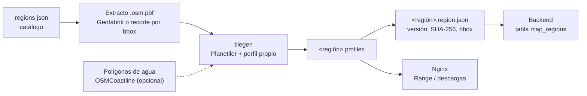

# Mapas

Los mapas de la plataforma son teselas vectoriales propias generadas a partir
de extractos de OpenStreetMap y guardadas en un archivo PMTiles por región. El
mismo archivo sirve para ver el mapa en línea (lecturas por rango desde Nginx)
y para usarlo sin conexión (descargado en el teléfono).

No se descargan teselas de `tile.openstreetmap.org` ni de ningún otro servidor
de teselas, y no se usan datos ni teselas de Google Maps.

## Proceso



```bash
make prepare-region REGION=guayaquil          # todo el proceso
make build-map REGION=guayaquil               # solo el mapa (extracto ya descargado)
make build-map REGION=guayaquil WATER=1       # con océanos
```

1. **Extracto.** Las regiones con `source.url` se descargan de Geofabrik
   (reintentos, reanudación, MD5 publicado y verificación con `osmium`); las que
   tienen `source.parent` + `bbox` se recortan del extracto padre con
   `osmium extract`. Ejemplo: Guayaquil se recorta de Ecuador.
2. **Teselas.** `tilegen` (Java 21, Planetiler 0.10.2) aplica el perfil propio
   `MapsPlatformProfile` y escribe PMTiles v3 de zoom 0 a 14. Los clientes
   amplían más allá del zoom 14 sin perder calidad (sobrezoom de vectores).
   Memoria de Java: `TILEGEN_MEMORY` (2g por defecto; 4g para Ecuador completo).
3. **Manifiesto.** `storage/maps/<carpeta>/<región>.region.json` con la versión,
   los SHA-256 del mapa y del paquete de routing, el bbox, los zooms, la fuente y
   la fecha de los datos OSM.
4. **Registro.** El backend lee los manifiestos al arrancar
   (`REGIONS_SYNC_ON_STARTUP`) o con `make regions-sync` y actualiza
   `map_regions`. Un administrador puede deshabilitar una región con
   `PATCH /api/v1/maps/regions/{id}`.

Los archivos se escriben primero con un nombre temporal y se renombran al
terminar: Nginx y el backend nunca ven un mapa a medio generar.

## Versiones

- La versión es `AAAA.MM.DD.HHMM` (UTC) del momento de la generación, o el
  valor de `REGION_VERSION` si se define.
- `GET /api/v1/maps/regions/{id}/version` devuelve la versión actual y
  `POST /api/v1/maps/regions/updates` compara las versiones que tiene un
  dispositivo.
- Para actualizar una región basta con volver a ejecutar `make prepare-region`
  (con `FORCE=1` para descargar un extracto nuevo aunque ya exista uno).

Ejemplo de manifiesto:

```json
{
  "code": "monaco",
  "name": "Mónaco",
  "country": "MC",
  "version": "2026.09.25.1844",
  "bbox": [7.349, 43.71, 7.491, 43.77],
  "minZoom": 0,
  "maxZoom": 14,
  "mapFile": "europe/monaco.pmtiles",
  "mapChecksum": "efc60875a9f9…",
  "routingFile": "monaco/monaco.valhalla.tar",
  "routingChecksum": "d3cd80973270…",
  "source": "https://download.geofabrik.de/europe/monaco-latest.osm.pbf",
  "dataTimestamp": "2016-03-05T00:26:02Z",
  "generatedAt": "2026-09-25T18:44:12Z"
}
```

## Esquema de teselas

Esquema propio `maps-platform` versión `1.0.0` (en la metadata del PMTiles).
Los nombres de las capas y de las clases siguen convenciones habituales de los
mapas vectoriales, pero el perfil es una implementación propia sobre los datos
de OpenStreetMap. Todas las capas con nombre incluyen `name`, y `name_es` /
`name_en` cuando difieren de `name`; el estilo usa `coalesce(name_es, name)`.

| Capa | Geometría | Contenido | Zoom mínimo |
| --- | --- | --- | --- |
| `water` | polígonos | ocean, lake, reservoir, lagoon, river, pond, basin, dock | 0 (océano), 4 (lagos), 6 (ríos), 10 (resto) |
| `waterway` | líneas | river, canal, stream, drain | 8, 11, 12, 13 |
| `water_name` | puntos | nombres de mares, bahías, lagos y lagunas | 0 (océanos), 3 (mares), según tamaño |
| `landuse` | polígonos | parques, bosques, humedales (manglar), cultivos, zonas residenciales, comerciales e industriales, cementerios, hospitales, escuelas, aeródromos… | 7, 9 o 12 según la clase |
| `building` | polígonos | edificios con `height` / `min_height` | 13 |
| `transportation` | líneas | motorway, trunk, primary, secondary, tertiary, minor, busway, service, track, path, rail, transit, ferry, runway, taxiway, aerialway; atributos `ramp`, `brunnel`, `layer`, `oneway`, `surface`, `access`, `ref` | 4 (autopistas) a 14 (senderos) |
| `boundary` | líneas | límites administrativos de nivel 2 a 8 (`admin_level`, `maritime`, `disputed`) | 0 (países), 4 (provincias), 8, 10 |
| `place` | puntos | país, provincia, ciudad, pueblo, aldea, isla, barrio (`rank`, `population`, `capital`) | 2 (país) a 14 |
| `poi` | puntos | 40 categorías (`class`): hospital, farmacia, escuela, gasolinera, supermercado, banco, parada de bus, aeropuerto… con `subclass` y `rank` | según importancia y tamaño |
| `housenumber` | puntos | números de casa | 14 (se muestran desde el 17) |

Los océanos solo existen si se pasan los polígonos de agua de OSMCoastline
(`WATER=1`, descarga única de ~1 GB en `storage/imports/`), porque
OpenStreetMap modela el mar como líneas de costa y no como polígonos. Sin
ellos, el mar se ve con el color de fondo del estilo.

### Mapa base mundial (Natural Earth)

La región `world` (`make prepare-region REGION=world`) se genera con 10 capas
de Natural Earth 1:10m (dominio público) en lugar de OpenStreetMap, para los
zooms 0 a 7, con **el mismo esquema**, de modo que un solo estilo dibuja el
mundo y las regiones:

| Natural Earth | Capa | Atributos |
| --- | --- | --- |
| `ne_10m_ocean` | `water` | `class=ocean` |
| `ne_10m_lakes` | `water` + `water_name` | `class=lake` / `reservoir`, nombres |
| `ne_10m_rivers_lake_centerlines` | `waterway` | `class=river`, nombres desde z5 |
| `ne_10m_geography_marine_polys` | `water_name` | `class=ocean` / `sea` / `bay` |
| `ne_10m_admin_0_countries` | `place` (en su punto de etiqueta) | `class=country`, `rank=1` |
| `ne_10m_admin_0_boundary_lines_land` | `boundary` | `admin_level=2`, `disputed` |
| `ne_10m_admin_1_states_provinces_lines` | `boundary` | `admin_level=4` |
| `ne_10m_populated_places` | `place` | `class=city` (capitales y 100.000+ hab.) o `town`, `capital`, `population` |
| `ne_10m_roads` | `transportation` | `motorway` / `trunk` / `primary` / `secondary` / `ferry` |
| `ne_10m_urban_areas` | `landuse` | `class=residential` |

El zoom mínimo de cada elemento sale de los campos `min_zoom`/`min_label` de
Natural Earth. Los países y ciudades se escriben además en
`world/world.places.json` para la búsqueda (ver [routing.md](routing.md)).

El visor pinta cada capa del estilo una vez por archivo, con el mundo debajo de
las regiones y visible hasta el zoom 8; una región contenida en otra más grande
(Guayaquil dentro de Ecuador) no se vuelve a dibujar.

## Estilo

`infrastructure/maps/style/style.json` ("Maps Platform Light", 45 capas) es el
único estilo de la plataforma; la app lleva una copia idéntica en
`mobile/assets/map/style.json` (el CI comprueba que no difieran). Es una
plantilla con dos marcadores que cada cliente reemplaza:

| Marcador | Valor |
| --- | --- |
| `__PMTILES_URL__` | Archivo PMTiles: `https://host/maps/ecuador/guayaquil.pmtiles` o `file:///…` |
| `__GLYPHS_URL__` | Carpeta de glifos: `https://host/maps/fonts` o `file:///…/fonts` |

El visor web (`/`) y la app (`MapStyleService`) hacen ese reemplazo. Nginx
sirve la plantilla en `/maps/style/style.json` sin caché para que los cambios
de estilo lleguen de inmediato.

### Glifos

Las etiquetas usan Noto Sans Regular, Medium e Italic en PBF SDF
(`{fontstack}/{range}.pbf`), con los rangos `0-255`, `256-511`, `512-767`,
`768-1023`, `1024-1279`, `7680-7935`, `8192-8447` y `8448-8703`: latín
completo con tildes y ñ, griego, cirílico, puntuación y flechas. Nginx los
sirve en `/maps/fonts/` y la app los lleva dentro para dibujar etiquetas sin
conexión. Procedencia y licencia en
[infrastructure/maps/fonts/README.md](../infrastructure/maps/fonts/README.md).

## Servir los mapas

| Ruta | Uso |
| --- | --- |
| `GET /maps/<carpeta>/<región>.pmtiles` | Lectura por rangos para ver el mapa en línea (`pmtiles://`); `206 Partial Content`, CORS y caché de 1 h |
| `GET /api/v1/maps/regions/{id}/download` | Descarga completa para usar sin conexión: el backend valida la región y Nginx entrega el archivo (`X-Accel-Redirect`) con `Range`, `If-Range`, `X-Checksum-Sha256` y `X-Region-Version` |
| `GET /api/v1/maps/regions/{id}/routing/download` | Paquete de routing de la región (mismo mecanismo) |
| `GET /maps/style/style.json` | Plantilla del estilo |
| `GET /maps/fonts/{fontstack}/{range}.pbf` | Glifos |

El resto de `/maps/` (manifiestos, archivos temporales) no es público. El
servidor no genera ni guarda teselas sueltas: todo sale del archivo PMTiles.

## Licencias

- Los datos son © OpenStreetMap contributors bajo la
  [Open Database License 1.0](https://opendatacommons.org/licenses/odbl/). Los
  PMTiles y los paquetes de routing contienen esos datos: al distribuirlos (por
  ejemplo, en las descargas de la app) se aplican las condiciones de la ODbL,
  atribución y compartir bajo la misma licencia las bases de datos derivadas.
- La atribución "© OpenStreetMap contributors" va en la metadata de cada
  PMTiles, en la fuente del estilo y siempre visible sobre el mapa en la app y
  en el visor.
- El mapa base mundial usa Natural Earth (dominio público); el visor muestra
  "Made with Natural Earth" junto a la atribución de OpenStreetMap.
- Los glifos Noto Sans y la tipografía Inter del visor están bajo la SIL Open
  Font License 1.1.
- Planetiler, MapLibre y PMTiles mantienen sus licencias; el visor incluye las
  de MapLibre GL JS y PMTiles junto a sus archivos.
